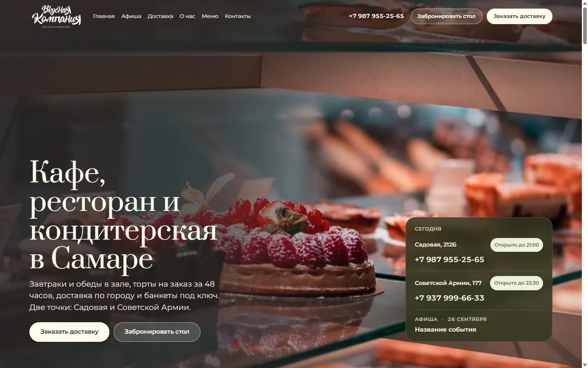
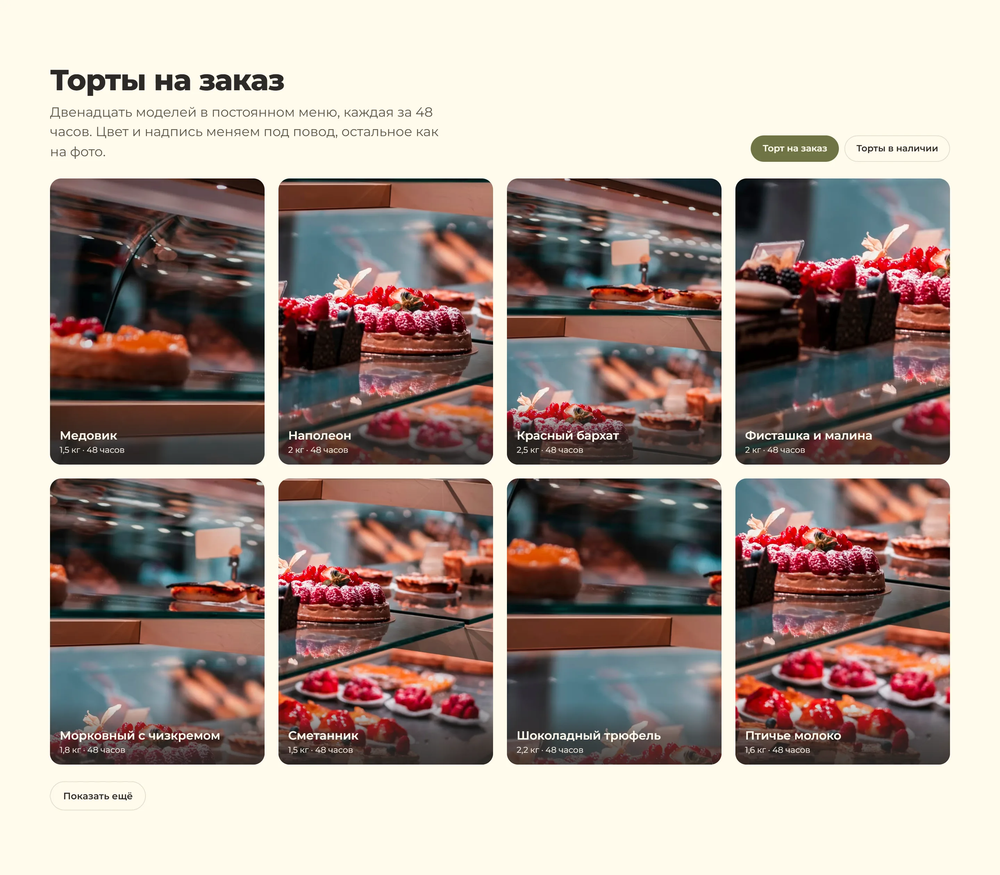
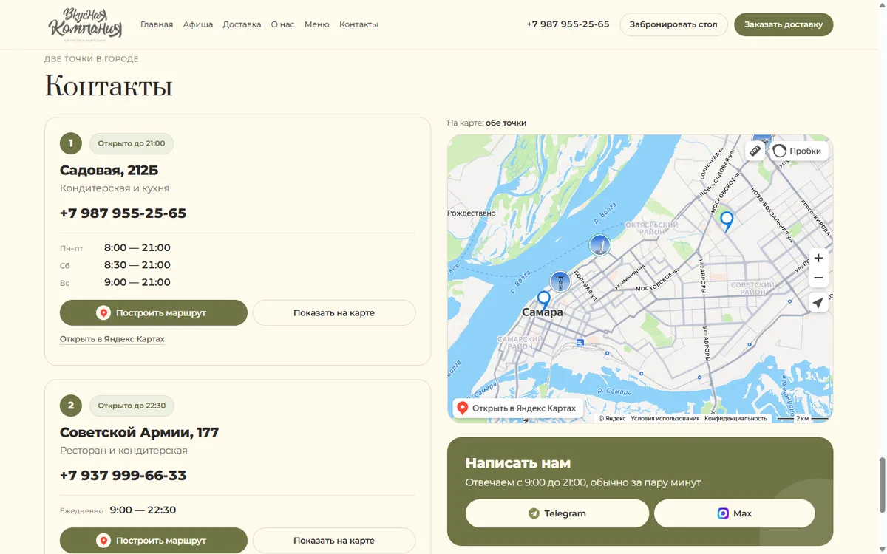
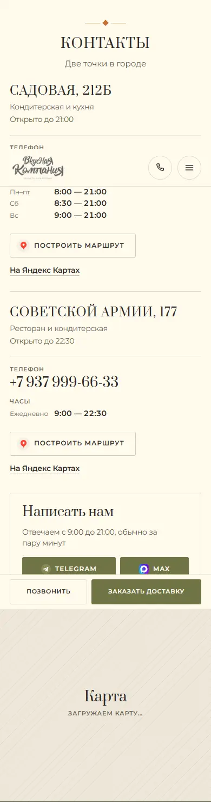

<div align="center">

# Vkusnaya Kompaniya — company site

One-page business-card site for a café, a restaurant, a confectionery, catering and
banquets — two locations in Samara, Russia.<br>
**Astro 5** static build, content managed in **Directus**, no UI framework.

[](https://astro.build)
[](https://directus.io)
[](https://www.typescriptlang.org/)
[](https://pnpm.io)



</div>

## Screenshots · Скриншоты

| Showcase · Витрина | Contacts · Контакты |
|---|---|
|  |  |

| Mobile — hero | Mobile — showcase | Mobile — contacts |
|---|---|---|
|  |  |  |

<details open>
<summary><b>🇬🇧 English</b> — documentation</summary>

### What it is

Ten sections, one scroll: hero, five directions (café, restaurant, confectionery,
catering, banquets), a photo slider of both rooms, poster of the month, text-only
promos per location, PDF menus, cake showcase, app and delivery, reviews, contacts
with both locations on one map. The actions are the same everywhere: book a table
(Telegram, Max or a call), order delivery in the app, open the catering site. No
forms, no cart, no prices.

Editors change posters, promos, menus, photos, texts and contacts in Directus; a save
triggers a rebuild and the static site updates within a minute.

### Highlights

- **Content is data, layout is code.** `src/lib/content.ts` fetches Directus at build
  time (or reads `src/data/fixture.json` when Directus is not configured) and
  normalizes everything into one typed `Content` object. Components never know the
  source.
- **The build refuses bad content.** Missing phone, a location without seven rows of
  hours, an image without `alt`, an over-long SEO title — the build fails with the
  field name instead of shipping a broken page.
- **No UI framework.** Interactive pieces — a header that is transparent over the
  hero and turns solid on scroll, booking dialog, sticky bottom bar, room slider,
  "show more", two lazy Yandex widgets — are covered by the platform (`<dialog>`,
  scroll-snap, `IntersectionObserver`).
- **Opening status computed in the browser** against `Europe/Samara`, never baked
  into HTML. Business hours come from the admin as seven rows per location and feed the
  table, the status pill and schema.org `openingHours`.
- **Images are content.** Every photo goes through `astro:assets` (AVIF, explicit
  `srcset`); the Directus access token never reaches the HTML.
- **Reviews come from the official Yandex Maps widget**, only aggregate numbers are
  quoted next to it.

### Tech stack

| | |
|---|---|
| Framework | [Astro 5](https://astro.build) — static output, zero hydration |
| Content | [Directus 11](https://directus.io) in Docker (`directus/`), REST at build time |
| Language | TypeScript (strict), plain CSS with custom properties |
| Images | `astro:assets` → AVIF, `<Image />` + `getImage()` for the LCP preload |
| Fonts | Montserrat Variable, self-hosted, Cyrillic and Latin subsets only |
| SEO | title/description/OG from the admin, JSON-LD `@graph`, sitemap, `robots.txt` |
| Tests | `node:assert` — no runner, Node reads the TypeScript directly |
| Hosting | own VPS: nginx + release symlink, rebuilt by webhook and nightly cron |

### Getting started

```bash
pnpm install
cp .env.example .env          # DIRECTUS_URL / DIRECTUS_TOKEN / PUBLIC_YANDEX_MAPS_KEY / SITE
pnpm dev                      # http://127.0.0.1:4321
pnpm build                    # static output in dist/ (runs content checks first)
pnpm preview                  # serve the built site
pnpm check                    # types and .astro diagnostics
pnpm test                     # schedule, selections and content checks
```

Without `DIRECTUS_URL` the site builds from the fixture. To develop against real
content run the admin locally:

```bash
cd directus && cp .env.example .env && docker compose up -d   # http://localhost:8055
pnpm setup                    # editor role, builder token, rebuild flow (needs DIRECTUS_ADMIN_TOKEN)
pnpm fixture                  # dump Directus → src/data/fixture.json + fixture-files/
```

Full install, roles and operations: [docs/DIRECTUS.md](docs/DIRECTUS.md).

> **Windows note.** Run from a path that matches the on-disk letter case
> (`D:\Code\Projects\…`, not `D:\code\projects\…`). On a mismatch Astro loses compile
> metadata and **silently drops all CSS** from the build.

### Project structure

| Path | What lives there |
|---|---|
| `src/lib/content.ts` | `getContent()`: Directus or fixture → typed `Content` |
| `src/lib/select.ts` | current poster, live promos, menu per direction |
| `src/data/site.ts` | schedule helpers, opening status, Yandex URL builders |
| `src/data/fixture.json` | content snapshot for dev and tests (`pnpm fixture`) |
| `src/components/` | one component per section, booking dialog, sticky bar |
| `src/layouts/BaseLayout.astro` | meta, OpenGraph, JSON-LD, fonts, LCP preload, Metrika |
| `src/scripts/` | booking dialog, sticky bar, header, lazy frames, map |
| `src/styles/global.css` | design tokens, buttons, shared patterns |
| `scripts/` | Directus setup, fixture export/import, document download |
| `directus/` | `docker-compose.yml`, schema snapshot, `.env.example` |
| `deploy/` | `build.sh`, nginx configs, webhook hook, crontab, backup |
| `docs/` | [design system](docs/DESIGN.md), [product notes](docs/PRODUCT.md), [Directus](docs/DIRECTUS.md) |

### How it stays fast

- **CSS is inlined** into the document — no render-blocking stylesheet request.
- **`@font-face` is declared by hand** for the Cyrillic and Latin subsets only.
- **The LCP image is preloaded** with the same `srcset`/`sizes` the markup uses.
- **Sections below the fold are skipped** until scrolled into view
  (`content-visibility: auto`).
- **Third-party widgets are deferred.** Yandex Maps and the reviews widget mount through
  an `IntersectionObserver` and never touch the critical path.

### Responsive scale

The design was drawn for 390 / 834 / 1440. In production those are custom properties
that switch at `768px` and `1200px`:

| | mobile | tablet | desktop |
|---|---|---|---|
| side padding | 18 | 36 | 72 |
| content width | 354 | 762 | 1296 |
| H1 / H2 | 34 / 25 | 47 / 33 | 66 / 42 |
| section padding | 44 | 64 | 92 |

### Tests

`pnpm test` runs three assertion files, no runner:

- `src/data/site.check.ts` — hours rows → schedule, human-readable table, schema.org
  `openingHours`, open/closed boundaries, Samara time zone, plural forms
- `src/lib/select.check.ts` — display windows, current poster, promo order, menu per
  direction
- `src/data/content.check.ts` — the fixture passes every rule the build enforces

### Deployment

Production runs on the client's VPS: nginx serves `/srv/vkus/current`, a symlink to the
latest release. Directus calls `deploy/build.sh` through a webhook after every save; a
nightly cron rebuilds so date windows take effect; a push to `main` deploys code via
`.github/workflows/deploy.yml`. Vercel builds the branch as a preview from the same
Directus. Step by step: [docs/DIRECTUS.md](docs/DIRECTUS.md).

</details>

<details>
<summary><b>🇷🇺 Русский</b> — документация</summary>

### Что это

Десять секций одним скроллом: первый экран, пять направлений (кафе, ресторан,
кондитерская, кейтеринг, банкеты), слайдер фото обоих залов, афиша месяца, акции по
адресам текстом, PDF меню, витрина тортов, приложение и доставка, отзывы, контакты с
обеими точками на одной карте. Действия везде одни: забронировать стол (Telegram, Max
или звонок), заказать доставку в приложении, перейти на сайт кейтеринга. Без форм,
корзины и цен.

Редакторы меняют афишу, акции, меню, фото, тексты и контакты в Directus; сохранение
запускает пересборку, и статический сайт обновляется в пределах минуты.

### Коротко

- **Контент — данные, вёрстка — код.** `src/lib/content.ts` забирает Directus при
  сборке (или читает `src/data/fixture.json`, если Directus не настроен) и приводит
  всё к одному типизированному объекту `Content`. Компоненты не знают источник.
- **Сборка не пропускает плохой контент.** Нет телефона, у точки не семь строк часов,
  у картинки нет `alt`, длинный SEO-заголовок — сборка падает с именем поля, а не
  выкладывает сломанную страницу.
- **Без UI-фреймворка.** Интерактив — шапка, прозрачная над первым экраном и
  непрозрачная после прокрутки, диалог брони, нижняя полоса, слайдер зала, «показать
  ещё», два ленивых виджета Яндекса — закрывает платформа (`<dialog>`, scroll-snap,
  `IntersectionObserver`).
- **Статус «Открыто до 21:00» считается в браузере** по `Europe/Samara`, а не
  вшивается в HTML. Часы приходят из админки семью строками на точку и разворачиваются
  в таблицу, плашку статуса и `openingHours` schema.org.
- **Фотографии — контент.** Каждое фото идёт через `astro:assets` (AVIF, явный
  `srcset`); токен Directus в HTML не попадает.
- **Отзывы — официальный виджет Яндекс Карт**, рядом только цифры с карточки.

### Стек

| | |
|---|---|
| Фреймворк | [Astro 5](https://astro.build) — статическая сборка, без гидратации |
| Контент | [Directus 11](https://directus.io) в Docker (`directus/`), REST при сборке |
| Язык | TypeScript (strict), обычный CSS на кастомных свойствах |
| Картинки | `astro:assets` → AVIF, `<Image />` и `getImage()` для preload |
| Шрифт | Montserrat Variable, свой хостинг, только кириллица и латиница |
| SEO | title/description/OG из админки, JSON-LD `@graph`, sitemap, `robots.txt` |
| Тесты | `node:assert` — без раннера, Node читает TypeScript сам |
| Хостинг | свой VPS: nginx + симлинк на релиз, пересборка по вебхуку и ночному крону |

### Запуск

```bash
pnpm install
cp .env.example .env          # DIRECTUS_URL / DIRECTUS_TOKEN / PUBLIC_YANDEX_MAPS_KEY / SITE
pnpm dev                      # http://127.0.0.1:4321
pnpm build                    # статика в dist/ (сначала проверки контента)
pnpm preview                  # посмотреть собранное
pnpm check                    # типы и диагностика .astro
pnpm test                     # расписание, выборки и проверки контента
```

Без `DIRECTUS_URL` сайт собирается из фикстуры. Чтобы работать с живым контентом,
поднимите админку локально:

```bash
cd directus && cp .env.example .env && docker compose up -d   # http://localhost:8055
pnpm setup                    # роль редактора, токен сборщика, Flow пересборки (нужен DIRECTUS_ADMIN_TOKEN)
pnpm fixture                  # выгрузка Directus → src/data/fixture.json + fixture-files/
```

Установка, роли и эксплуатация: [docs/DIRECTUS.md](docs/DIRECTUS.md).

> **Windows-грабли.** Запускать из пути с тем же регистром, что и на диске
> (`D:\Code\Projects\…`, не `D:\code\projects\…`). При расхождении Astro теряет
> метаданные компиляции и **молча выбрасывает весь CSS** из сборки.

### Что где лежит

| Путь | Что это |
|---|---|
| `src/lib/content.ts` | `getContent()`: Directus или фикстура → типизированный `Content` |
| `src/lib/select.ts` | текущая афиша, живые акции, меню направления |
| `src/data/site.ts` | расписание, статус точки, ссылки на Яндекс |
| `src/data/fixture.json` | снимок контента для разработки и тестов (`pnpm fixture`) |
| `src/components/` | по компоненту на секцию, диалог брони, нижняя полоса |
| `src/layouts/BaseLayout.astro` | мета, OpenGraph, JSON-LD, шрифт, preload, Метрика |
| `src/scripts/` | диалог, полоса, шапка, ленивые кадры, карта |
| `src/styles/global.css` | токены, кнопки, общие паттерны |
| `scripts/` | настройка Directus, выгрузка и импорт фикстуры, скачивание документов |
| `directus/` | `docker-compose.yml`, снапшот схемы, `.env.example` |
| `deploy/` | `build.sh`, конфиги nginx, вебхук, крон, бэкап |
| `docs/` | [дизайн-система](docs/DESIGN.md), [продукт](docs/PRODUCT.md), [Directus](docs/DIRECTUS.md) |

### За счёт чего быстро

- **CSS инлайнится** в документ — нет блокирующего запроса за стилями.
- **`@font-face` объявлен вручную** только для кириллицы и латиницы.
- **LCP-кадр предзагружается** с тем же `srcset`/`sizes`, что и в разметке.
- **Секции ниже первого экрана не считаются**, пока до них не долистали
  (`content-visibility: auto`).
- **Сторонние виджеты отложены.** Карта и отзывы Яндекса монтируются через
  `IntersectionObserver` и не попадают в критический путь.

### Адаптив

Макет нарисован под 390 / 834 / 1440. В проде это CSS-переменные, переключающиеся на
`768px` и `1200px`:

| | телефон | планшет | десктоп |
|---|---|---|---|
| боковой отступ | 18 | 36 | 72 |
| контент | 354 | 762 | 1296 |
| H1 / H2 | 34 / 25 | 47 / 33 | 66 / 42 |
| отступ секции | 44 | 64 | 92 |

### Тесты

`pnpm test` прогоняет три файла проверок, без раннера:

- `src/data/site.check.ts` — строки часов → расписание, человеческая таблица,
  `openingHours` schema.org, границы открытия и закрытия, часовой пояс Самары,
  склонение числительных
- `src/lib/select.check.ts` — окна показа, текущая афиша, порядок акций, меню
  направления
- `src/data/content.check.ts` — фикстура проходит все правила, которые требует сборка

### Выкладка

Прод живёт на VPS клиента: nginx раздаёт `/srv/vkus/current` — симлинк на свежий
релиз. Directus дёргает `deploy/build.sh` вебхуком после каждого сохранения; ночной
крон пересобирает сайт, чтобы сработали окна дат; пуш в `main` выкладывает код через
`.github/workflows/deploy.yml`. Vercel собирает ветку как превью из того же Directus.
По шагам: [docs/DIRECTUS.md](docs/DIRECTUS.md).

</details>

## Related · Соседние ресурсы

| | |
|---|---|
| Delivery shop · Магазин доставки | [vkusdostavka.shop](https://vkusdostavka.shop/) |
| Catering · Кейтеринг и банкеты | [vkusnayakompania.ru](https://vkusnayakompania.ru/) |
| Apps · Приложение | [App Store](https://apps.apple.com/app/id6477568088) · [Google Play](https://play.google.com/store/apps/details?id=com.foodpicasso.cateringvkusnaya) |
| Social · Соцсети | [VK](https://vk.ru/vkusnayakompania) · [Telegram](https://t.me/vkusnayakompania) |
